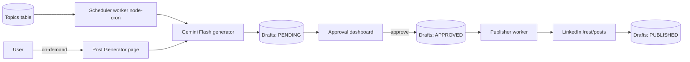

# LinkedIn Autoposter

A Next.js (TypeScript) app that generates LinkedIn posts from topics via Google Gemini Flash, queues them for human approval, and auto-publishes approved drafts on a schedule. Posts can be created two ways: automatically by the scheduler on a cadence, and on-demand by the user at any time via a dedicated Post Generator page. Personal-profile posting ships first; company-page posting is added later once LinkedIn's gated Community Management API access is approved.

## Key constraints (from LinkedIn API research)

- Personal posting uses the `w_member_social` scope via the self-serve "Share on LinkedIn" product (easy, self-serve).
- Company page posting needs `w_organization_social` via the **Community Management API** — gated, commercial-only, super-admin verification, ~2-4 week manual review. This is why it is a later phase.
- All posting hits one endpoint: `POST https://api.linkedin.com/rest/posts` with headers `LinkedIn-Version: 2026XX`, `X-Restli-Protocol-Version: 2.0.0`. Only the `author` URN + scope differ (`urn:li:person:{id}` vs `urn:li:organization:{id}`).
- OAuth tokens expire in 60 days; refresh tokens last ~365 days, so token refresh is required.
- Rate limit ~100 calls/day/member — keep cadence modest.

## Architecture

Both entry points (scheduler and the Post Generator page) feed the same Gemini generator and produce PENDING drafts that flow through the same approval + publish pipeline.

## Tech choices

- Next.js (App Router) + TypeScript for dashboard UI and API routes.
- Prisma + SQLite for cheap, zero-infra persistence (swappable to Postgres later).
- `@google/genai` (the current unified Google Gen AI SDK; `@google/generative-ai` is deprecated/EOL) with model `gemini-2.5-flash-lite` (cheapest) or `gemini-2.5-flash`.
- `node-cron` standalone worker process (`worker/scheduler.ts`) sharing the Prisma client.
- Token encryption at rest with a `APP_ENCRYPTION_KEY`.

---

## Phase 0 — Prerequisites (manual, no code)

- Create a LinkedIn app in the Developer Portal; add **Sign In with LinkedIn using OpenID Connect** + **Share on LinkedIn** products to get `w_member_social`.
- Set redirect URL (e.g. `http://localhost:3000/api/auth/linkedin/callback`), capture Client ID/Secret.
- Get a Google AI Studio API key for Gemini.
- Outcome: credentials ready for `.env`.

## Phase 1 — Project scaffolding

- `npx create-next-app@latest` (TS, App Router), add Prisma + SQLite.
- Define schema in `prisma/schema.prisma`: `Account` (LinkedIn connection + encrypted tokens + author URN/type), `Topic` (text, status, cadence), `Draft` (topicId, content, status enum PENDING/APPROVED/REJECTED/PUBLISHED/FAILED, scheduledAt, linkedInPostUrn).
- `lib/env.ts` for typed env vars; `.env.example`; `lib/prisma.ts` singleton.
- Outcome: app boots, DB migrates.

## Phase 2 — LinkedIn OAuth (personal)

- `app/api/auth/linkedin/route.ts` (redirect to LinkedIn authorize with `openid profile w_member_social`) and `app/api/auth/linkedin/callback/route.ts` (exchange code for token, fetch member id via `/v2/userinfo`, store encrypted `Account`).
- `lib/linkedin/oauth.ts` for authorize URL, token exchange, and refresh logic; `lib/crypto.ts` for token encryption.
- Outcome: user connects their LinkedIn personal account; tokens persisted + refreshable.

## Phase 3 — Gemini content generation + on-demand Post Generator

- `lib/llm/gemini.ts`: `generatePost(topic, options)` calling Gemini Flash with a tuned system prompt (hook, body, CTA, hashtags, ~1300 char cap, no markdown). Return plain text. Shared by both the scheduler and the on-demand page.
- Topics CRUD: `app/api/topics` + minimal UI page `app/topics/page.tsx`.
- `app/api/drafts/generate` (POST): accepts either a `topicId` or an ad-hoc `topic` string (+ optional tone/length options), runs the generator, and saves a PENDING draft.
- **Post Generator page** `app/generate/page.tsx`: a free-form UI where the user types any topic/prompt anytime, picks tone/length, clicks Generate to preview the Gemini output, can regenerate or tweak, and then saves it as a PENDING draft (or sends straight to the approval queue). Independent of the scheduler — works on demand even with no saved topics.
- Outcome: user can generate a post at any moment from the Post Generator page, in addition to scheduled generation; both paths land in the same drafts queue.

## Phase 4 — Approval workflow + dashboard

- Dashboard `app/page.tsx`: list PENDING drafts with edit textarea, Approve / Reject / Regenerate, and a connected-accounts panel.
- API routes: `app/api/drafts/[id]` (PATCH edit/status), `app/api/drafts/[id]/regenerate`.
- Outcome: human-in-the-loop review; only APPROVED drafts are eligible to post.

## Phase 5 — Scheduling + publishing engine

- `worker/scheduler.ts` (run via `node-cron`, separate process): on cadence, pick active topics and create PENDING drafts (the "generate on schedule" half).
- `worker/publisher.ts`: poll for APPROVED drafts whose `scheduledAt` is due, call `lib/linkedin/post.ts` -> `POST /rest/posts` with `urn:li:person:{id}`, mark PUBLISHED + store returned URN, or FAILED with error + retry/backoff.
- `lib/linkedin/post.ts` builds the payload + version headers; centralizes token-refresh-on-401.
- Outcome: hands-off loop — scheduled generation, manual approval, timed auto-posting to personal profile.

## Phase 6 — Company page posting (gated)

- Apply for Community Management API (Development -> Standard tier); requires legal org + privacy policy + screen recording.
- Add `w_organization_social` scope, fetch admined orgs via `organizationAcls`, let user pick a page, store `authorType=ORGANIZATION` + `urn:li:organization:{id}` on `Account`.
- Reuse `lib/linkedin/post.ts` (only the author URN changes); add page selector in UI.
- Outcome: same flow publishes to company pages once approved.

## Phase 7 — Hardening + deploy

- Structured logging, rate-limit guard (<100/day), token-refresh cron, error notifications.
- Optional analytics (org-page analytics only; member analytics API is closed).
- Dockerfile + deploy (Fly.io/Railway/VPS) with persistent SQLite volume or migrate to Postgres; secrets via env.
- Outcome: production-ready, low-cost deployment.

## Cost note

Gemini Flash/Flash-Lite makes per-post generation effectively a fraction of a cent; main cost is hosting (a small VPS/free-tier is enough).
