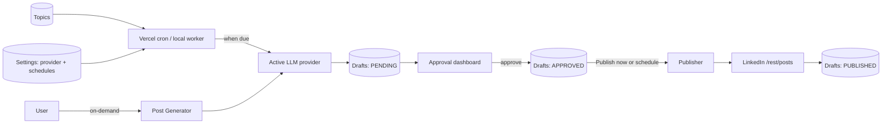

# FirmBroadcast

**FirmBroadcast** is a LinkedIn autoposter that drafts posts with AI, queues them for human review, and publishes approved content to your personal LinkedIn profile on a schedule—or on demand.

Posts enter the same approval pipeline whether you generate them manually or the background worker creates them from saved topics. You stay in control: nothing goes live until you approve it (unless you explicitly hit **Publish now**).

> **Status:** Alpha — Phases 0–5 of the [implementation plan](PLAN.md) are complete, plus alpha polish (multi-model settings, friendly schedules, status-aware dashboard).

---

## Features

- **AI post generation** — Draft LinkedIn posts from any topic or saved prompt. Supports **Google Gemini** and **DeepSeek** (extensible via a provider registry).
- **Post Generator** — Preview, edit, and save drafts on demand (`/generate`).
- **Topics** — Reusable prompts the scheduler turns into drafts when generation is enabled (`/topics`).
- **Approval dashboard** — Review pending drafts, edit copy, approve or reject, and paginate large queues (`/`).
- **Manual publish** — Publish approved drafts immediately with **Publish now**, or let the worker post on schedule.
- **Scheduled generation & publishing** — Separate, user-friendly schedules (hourly, every N hours, daily, weekly) configured in Settings—no raw cron.
- **LinkedIn OAuth** — Connect a personal profile (`w_member_social`) and publish via the LinkedIn Posts API.
- **Encrypted secrets** — LinkedIn tokens and AI API keys are encrypted at rest (AES-256-GCM) in Supabase Postgres.
- **Email/password login** — Supabase Auth protects the app; create users in the Supabase dashboard.

---

## How it works



1. **Configure** — Open **Settings** (`/settings`): add an AI provider API key, pick the active model, connect LinkedIn on the dashboard, and enable generation/publishing schedules if you want automation.
2. **Generate** — Create drafts manually from the Post Generator, or let the worker generate one draft per active topic when the generation schedule is due.
3. **Review** — On the dashboard, edit copy, approve, reject, or regenerate pending drafts.
4. **Publish** — Click **Publish now** on an approved draft, or enable the publishing schedule so the worker posts due approved drafts automatically.

---

## Tech stack

| Layer | Choice |
| --- | --- |
| App | [Next.js 16](https://nextjs.org) (App Router) + TypeScript + React 19 |
| Styling | Tailwind CSS 4 |
| Database | [Supabase](https://supabase.com) Postgres via [Prisma 7](https://www.prisma.io) + `@prisma/adapter-pg` |
| AI | Pluggable adapters: `@google/genai` (Gemini), OpenAI-compatible `fetch` (DeepSeek) |
| Scheduling | [Vercel Cron Jobs](https://vercel.com/docs/cron-jobs) (`/api/cron/tick` every minute); local dev worker optional |
| Auth | Supabase Auth (email/password) + LinkedIn OAuth 2.0 for posting |

---

## Prerequisites

Before running FirmBroadcast locally, you need:

1. **Node.js 20+** and npm
2. **A Supabase project** with:
   - Postgres database (copy the connection string from Project Settings → Database)
   - Auth enabled with at least one user (Authentication → Users → Add user)
   - Project URL and anon key (Project Settings → API)
3. **A LinkedIn Developer app** with:
   - [Sign In with LinkedIn using OpenID Connect](https://www.linkedin.com/developers/)
   - **Share on LinkedIn** product (for `w_member_social`)
   - Redirect URL: `http://localhost:3000/api/auth/linkedin/callback` (or your `APP_URL` + `/api/auth/linkedin/callback`)
4. **An encryption key** — 32-byte secret for token/key encryption (`openssl rand -base64 32`)
5. **An AI provider API key** — Gemini and/or DeepSeek (configured in the UI after first boot; not required in `.env`)

See [PLAN.md](PLAN.md) Phase 0 for LinkedIn portal setup details.

---

## Getting started

### 1. Install dependencies

```bash
npm install
```

This runs `prisma generate` automatically via `postinstall`.

### 2. Configure environment

Copy the example env file and fill in the required values:

```bash
cp .env.example .env
```

Minimum required variables:

| Variable | Description |
| --- | --- |
| `DATABASE_URL` | Supabase Postgres connection string (use the **Transaction pooler** URL on Vercel) |
| `NEXT_PUBLIC_SUPABASE_URL` | Supabase project URL |
| `NEXT_PUBLIC_SUPABASE_PUBLISHABLE_KEY` | Supabase publishable key (`sb_publishable_…`; legacy `NEXT_PUBLIC_SUPABASE_ANON_KEY` also accepted) |
| `APP_URL` | Public app URL, e.g. `http://localhost:3000` |
| `APP_ENCRYPTION_KEY` | 32-byte key for encrypting LinkedIn tokens and AI keys at rest |
| `LINKEDIN_CLIENT_ID` | LinkedIn app Client ID |
| `LINKEDIN_CLIENT_SECRET` | LinkedIn app Client Secret |
| `CRON_SECRET` | Random secret for `/api/cron/tick` (required in production on Vercel) |

AI provider keys and schedules are **not** set in `.env`—use the Settings page after the app starts.

Optional tuning (see [.env.example](.env.example)):

| Variable | Default | Description |
| --- | --- | --- |
| `LINKEDIN_REDIRECT_URI` | `${APP_URL}/api/auth/linkedin/callback` | OAuth callback |
| `LINKEDIN_API_VERSION` | `202605` | `LinkedIn-Version` header (`YYYYMM`) |
| `MAX_PUBLISH_ATTEMPTS` | `5` | Retries before a draft is marked `FAILED` |
| `PUBLISH_BATCH_SIZE` | `5` | Max drafts published per worker tick |

### 3. Run database migrations

```bash
npm run db:migrate
```

### 4. Start the web app

```bash
npm run dev
```

Open [http://localhost:3000](http://localhost:3000) and sign in with the Supabase user you created.

### 5. First-time setup in the UI

1. **Settings** (`/settings`) — Add a Gemini or DeepSeek API key, select a model, and mark one provider as **Active**. Optionally enable **Automatic post generation** and **Automatic publishing** with friendly schedules.
2. **Dashboard** (`/`) — Click **Connect LinkedIn** and authorize your personal profile.
3. **Topics** (`/topics`) — Add reusable prompts (optional; used by scheduled generation).
4. **Post Generator** (`/generate`) — Create your first draft manually.

### 6. Local scheduling (optional)

In production on **Vercel**, scheduled generation and publishing run automatically via a cron job (`vercel.json` → `/api/cron/tick` every minute). Set `CRON_SECRET` in your Vercel project env vars; Vercel sends it as `Authorization: Bearer …`.

For **local development**, run the dev worker in a second terminal (same logic as the cron tick):

```bash
npm run worker
```

One-shot commands (useful for debugging):

```bash
npm run worker:scheduler   # run one generation tick, then exit
npm run worker:publisher   # run one publish tick, then exit
```

---

## Deploying to Vercel + Supabase

1. **Supabase** — Create a project, run migrations against it (`npm run db:migrate`), and add at least one Auth user.
2. **Vercel** — Import the repo and set environment variables from `.env.example`.
3. **Database URL** — Use the Supabase **Transaction pooler** connection string (port `6543`) for `DATABASE_URL` on Vercel.
4. **Cron** — `vercel.json` is included; set `CRON_SECRET` in Vercel. Cron jobs only run on **production** deployments.
5. **Auth redirect** — In Supabase → Authentication → URL Configuration, add your Vercel domain to **Site URL** and **Redirect URLs** (include `/auth/callback`).
6. **LinkedIn** — Add your production callback URL to the LinkedIn app redirect allowlist.

---

## Pages

| Route | Purpose |
| --- | --- |
| `/login` | Email/password sign-in (Supabase Auth) |
| `/` | Dashboard — connected accounts, draft filters (Pending / Approved / Rejected / Published), approval actions, load-more pagination |
| `/generate` | Post Generator — ad-hoc topic, tone/length, preview, save to queue |
| `/topics` | Manage reusable prompts; active topics are generated on the global schedule |
| `/settings` | AI provider keys & models, active provider, generation & publishing schedules |

---

## Draft lifecycle

| Status | Meaning | Typical actions |
| --- | --- | --- |
| `PENDING` | Awaiting review | Approve, Reject, Regenerate, Save edits, Delete |
| `APPROVED` | Ready to publish | **Publish now**, Revert to pending, Save edits, Delete |
| `REJECTED` | Declined | Restore to pending, Delete |
| `PUBLISHED` | Live on LinkedIn | View on LinkedIn, Delete |
| `FAILED` | Publish error (retries exhausted or manual failure) | Retry publish, Revert to pending, Delete |

Approved drafts with a future `scheduledAt` are published when that time is reached (worker). Null `scheduledAt` means publish as soon as the publishing schedule runs (or use **Publish now**).

---

## AI providers

Providers are registered in code ([`lib/llm/registry.ts`](lib/llm/registry.ts)). The Settings UI exposes each registered provider; credentials and the chosen model live in the `LlmProvider` table (encrypted).

| Provider | Models (defaults in bold) |
| --- | --- |
| Google Gemini | **gemini-2.5-flash-lite**, gemini-2.5-flash, gemini-2.5-pro |
| DeepSeek | **deepseek-chat**, deepseek-reasoner |

To add a new provider later:

1. Implement `LLMAdapter` in `lib/llm/<provider>.ts`
2. Register it in `lib/llm/registry.ts`
3. No schema or Settings UI changes required—the new provider appears automatically

---

## Schedules

Generation and publishing use **independent** schedules, configured under **Settings**:

| Preset | Behavior |
| --- | --- |
| Every hour | Runs at a chosen minute past each hour |
| Every N hours | Runs on a fixed interval from the last run |
| Daily at a time | Runs once per day at hour:minute (server local time) |
| Weekly on a day | Runs once per week on the chosen weekday and time |

When generation is due, the worker creates **one PENDING draft per ACTIVE topic**. When publishing is due, it publishes up to `PUBLISH_BATCH_SIZE` approved drafts whose `scheduledAt` is null or in the past.

---

## Scripts

| Command | Description |
| --- | --- |
| `npm run dev` | Next.js development server |
| `npm run build` | Production build |
| `npm run start` | Start production server |
| `npm run lint` | ESLint |
| `npm run worker` | Local dev scheduler (master tick every minute) |
| `npm run worker:scheduler` | Single generation tick |
| `npm run worker:publisher` | Single publish tick |
| `npm run db:migrate` | Apply Prisma migrations |
| `npm run db:studio` | Open Prisma Studio |
| `npm run db:generate` | Regenerate Prisma client |

---

## Project structure

```
app/
  login/                # Supabase email/password sign-in
  page.tsx              # Dashboard
  generate/             # Post Generator
  topics/               # Topics CRUD UI
  settings/             # AI + schedule settings
  api/                  # Route handlers (drafts, topics, settings, OAuth, cron, …)
  auth/callback/        # Supabase auth callback
  components/           # Shared UI (nav, draft-card, …)
lib/
  supabase/             # Browser + server Supabase clients, session middleware
  cron/                 # Vercel cron tick + auth verification
  llm/                  # Universal generation (registry, adapters, generatePost)
  linkedin/             # OAuth, token refresh, publish
  schedule.ts           # Friendly schedule presets + due logic
  settings.ts           # AppSetting singleton helpers
  crypto.ts             # AES-256-GCM encryption
  env.ts                # Typed environment access
worker/
  index.ts              # Local dev scheduler loop
  scheduler.ts          # Generate drafts from active topics
  publisher.ts          # Publish due approved drafts
prisma/
  schema.prisma         # Postgres schema
  migrations/           # Migration history
vercel.json             # Vercel cron configuration
middleware.ts           # Supabase session refresh + route protection
```

---

## LinkedIn API notes

- **Personal posting** uses `w_member_social` via the self-serve Share on LinkedIn product.
- **Company pages** require the gated Community Management API (`w_organization_social`)—planned for a later phase ([PLAN.md](PLAN.md) Phase 6).
- Posts are created with `POST https://api.linkedin.com/rest/posts` and version headers `LinkedIn-Version` + `X-Restli-Protocol-Version: 2.0.0`.
- LinkedIn rate limits are roughly **100 API calls per member per day**—keep publishing cadence modest.

---

## Roadmap

| Phase | Status | Summary |
| --- | --- | --- |
| 0 | Manual | LinkedIn app + credentials |
| 1 | Done | Scaffolding, Prisma, Supabase Postgres |
| 2 | Done | LinkedIn OAuth (personal) |
| 3 | Done | AI generation + Post Generator |
| 4 | Done | Approval dashboard |
| 5 | Done | Scheduler + publisher (Vercel cron + local worker) |
| Alpha | Done | Multi-model settings, friendly schedules, manual publish, paginated dashboard, Supabase Auth |
| 6 | Planned | Company page posting |
| 7 | Planned | Hardening |

Full details: [PLAN.md](PLAN.md).

---

## Security

- Never commit `.env` or real API keys.
- `APP_ENCRYPTION_KEY` protects LinkedIn OAuth tokens and AI provider keys in the database.
- The Settings API returns `keySet: true/false` only—never the decrypted key.
- Supabase Auth protects all routes except `/login` and `/auth/callback`. Cron endpoints use `CRON_SECRET` instead of session auth.
- Create app users in the Supabase dashboard (Authentication → Users); self-service signup is not enabled in the UI yet.

---

## License

Private project (`"private": true` in `package.json`). All rights reserved unless otherwise specified by the repository owner.
